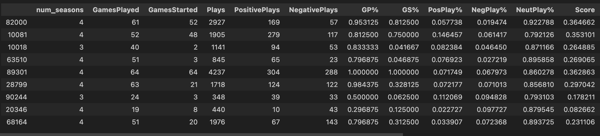
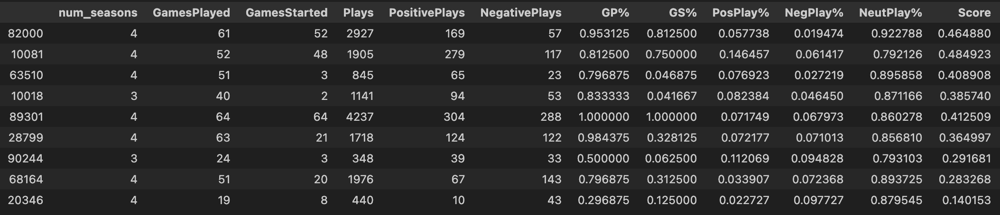
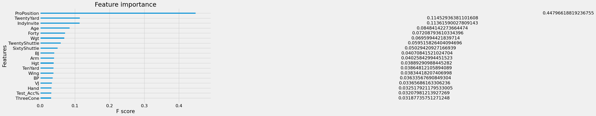

## 1) How did you come up with your professional production rankings?  What other information would be valuable to improve professional rankings?

Given the data available, I thought there were two approaches one could take to ranking NFL players. One could think of NFL success as, how much time a player's spent in the NFL, which closer aligns to the sentiment "did he 'make it' to the big leagues" - especially when accounting for quality of snaps played. A guy who's played every game over the last three years is likelier to be a better player than the guy who's only sporadically made it into the starting lineup.

But one could also frame success solely as a player's results on the field, which is independent of the number of games he played. A player could do well on the field while not playing a lot for many reasons, such as injury, more players ahead on the depth chart, or lack of appreciation from the coach. 

Given these two viewpoints, I wanted a metric that used information from both of these viewpoints. The final score metric is a weighted combination of both of these viewpoints, with each viewpoint comprising of a combination of the stats available.

score = 0.2 * (0.7 * Games_Played_% + 0.3 * Games_Started_% ) 
\+ 0.8 * (2.0 * Positive_Play_% + 0.3 * Neutral_Play_% - 2.0 * Negative_Play_%)

The weights were chosen through both intuition and a very simple form of "validation testing". I randomly sampled several players, who based on their stats I would know where I wanted them ranked relative to one another.

Here is a small sample of the list of the players, scored using an initial choice of all the weight hyperparameters. For example, I knew I wanted player 10081 ranked above player 82000, both because of his higher start percentage, but also because of his much higher positive play percentage.

So I adjusted the weights to get the desired output in the small validation sample.

To come up with professional production rakning, a player's entire career production is just the sum of each of their individual season scores. For simplicity, we treated all season's as equal, but one could weight later seasons more heavily under the idea that they better represent a prospect's true talent (as they hopefully get better with experience).

One noteworthy thing to mention is that each position's average score is varies significantly. For example, the average RB score is 0.508 while the average OC score is 0.256.

Position - Avg_Score  
DC  -   0.283457  
DE  -   0.385116  
DS  -   0.313984  
DT  -   0.374987  
FB  -   0.314025  
ILB  -  0.293571  
OC   -  0.256561  
OG   -  0.247711  
OLB  -  0.405178  
OT   -  0.216458  
QB   -  0.325457  
RB   -  0.508370  
TE   -  0.318163  
WR   -  0.384706  

This is an artifact of the distribution of Positive Plays and Negative Plays - RBs by far have the highest percentage of positive plays (PosPlay%). If one wanted to compare players across positions, it would be best to normalize the scores within each position group. I have left them unnormalized because of the specific prompt, as we solely want to rank production. And the nature of the given data indicates that running backs are much more productive than other positions.

This leads into the discussion of what other information would be more valuable - either further explanation of how plays are labeled, or a more granular estimate of performance. Instead of binary labels such as good or bad, having the continuous PFF grade would better differentiate performance and give us more information. Additionally, it would be useful to know the context surrounding the plays. For example, can multiple players register a positive play on one snap? 

One solution would be grading how every player performed in the play, and then weighting it based on their involvement in the play. This could allocate value across positions that we know more closely correlates to true position value (e.g. we know RBs aren't the most valuable position, despite them being scored the highest).

### a)      How confident are you in signing free agents based on these rankings?

I would be more confident in signing free agents based on these rankings than prediction model, because we have data on their past production. If we have the number of good plays and bad plays, that should give us a pretty good idea of how good they've played.

However, the year to year correlation between our score metric is about the same [correlation](https://footballfanspot.com/2021/08/12/which-stats-are-most-predictable-and-predictive/) between a team's season win totals and next season's win totals - 0.26 when excluding a player's first four years (while they're on their rookie contract and can't be signed in free agency), and 0.22 when looking at all years.

Intuitively I think this gives us a good feel for how confident we should be - expect a reasonable judge of their skill but know it's not generally a strong predictor.

## 2) How did you come up with your college measurable rankings?  What other information would be valuable to improve those rankings?

Given we have a way to measure NFL performance, we can rank the desirability of college prospects by their predicted measure of NFL performance. While there are many choices of models to do this, I used an xGBoost model to predict a prospect's NFL score given their combine data. I chose the xGBoost model for several reasons:

1) Tree-based model to better capture non-linear relationships
2) Tree-based models aren't negatively affected by collinear features
3) Simpler solutions to handle missing data
4) Simple feature importance calculations

I considered using an RAS-style metric to rank college prospects but didn't think it aligned as well with the prompt. Regressing combine data to a metric that defines NFL value seemed to better capture "desirability" than only grading prospects based on their normalized combine metrics. RAS-style metrics also fail to capture the idea that different combine drills are important for different positions, which theoritically the regressor-approach could convey.

Other information that would have been valuable is college in-game performance. Raw athletic ability doesn't tell the whole story of how a prospect will translate to the NFL, nor say how well they performed in college football games.

### a) How confident are you in drafting players based on these rankings?

Firstly, the model is better at predicting some positions compared to others. For example, relatively speaking I would be less confident in drafting a quarterback than an offensive lineman.

Position - MAE :   
DC  -   0.045666   
DE  -   0.068493  
DS  -   0.041002  
DT  -   0.073560  
FB  -   0.077323  
ILB  -  0.055289  
OC   -  0.062980  
OG   -  0.056660  
OLB  -  0.055158  
OT   -  0.064692  
QB   -  0.077167   
RB   -  0.058583  
TE   -  0.049408  
WR   -  0.047455  

Secondly, I would be less confident in drafting players solely based on these rankings because of the absence of college production data. While we would expect there to be a strong correlation between a prospect's raw athleticism and their NFL production, we would also expect a strong correlation betweena prospect's collegiate production and their NFL production, which is absence in our input.

### b) Are some metrics more important than others? 

Intuitively we know some metrics must be more important than others, and in tree-based models we can calculate each variables feature importance to show how important each variable is in the model. At a high level, xGBoost's gain feature importance metric measures the relative contribution of the corresponding feature to the model calculated by taking each feature's contribution for each tree in the model.

We see that position is by far the most important feature, and tests such as the Forty and Twenty are twice as important as the Three Cone Drill and Test Accuracy. The only thing we note are that these feature importances are not conditioned on position - e.g. Hand has a very low relative importance in general. However, we would expect this to vary across position, as for example it might be more important for quarterbacks.

### c) What methods did you use to deal with incomplete data and why?

xGBoost handles missing data "out-of-the-box", as in the author's of the [algorithm](https://arxiv.org/pdf/1603.02754v3.pdf) describe their procedure for dealing with missing data. At each node in a tree, a default direction is added for the missing data examples to flow through, which is learned by choosing the assignment that minimizes the objective function.

